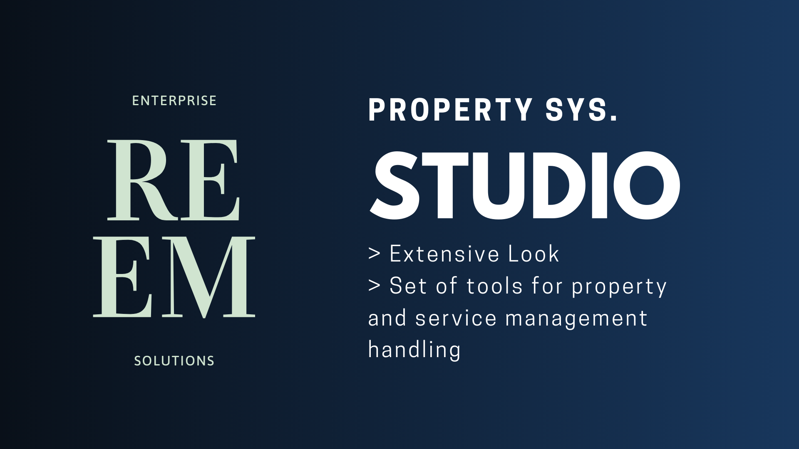
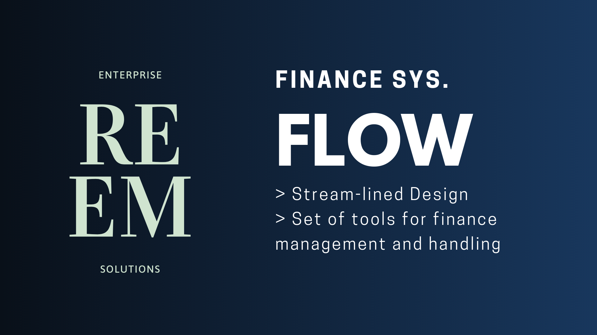
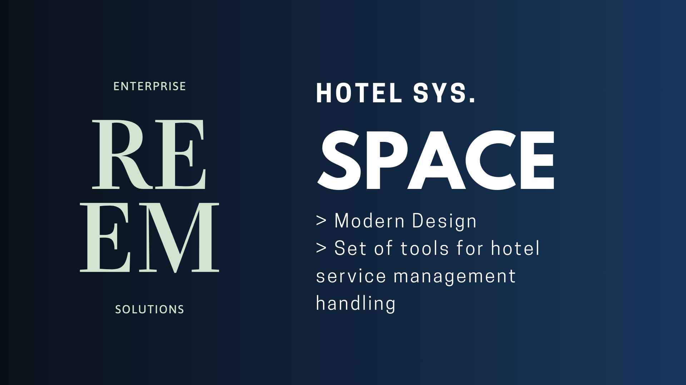
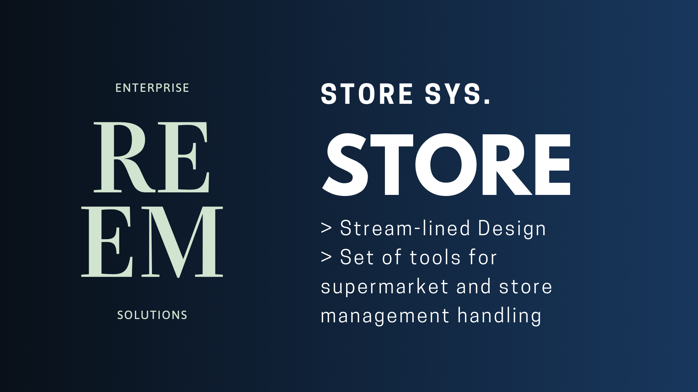

    
    <h2>Reem</h2>
    

        
Powerful and Intuitive ERP Suite

    

Programs:

	
	
	
	

	Reem Suite  
	<a href="https://reemsuite.com" target="_blank">
		<picture>
			<source media="(prefers-color-scheme: dark)" srcset="./reem/public/images/trademarks/web_icon.png">
			
		</picture>
	</a>

